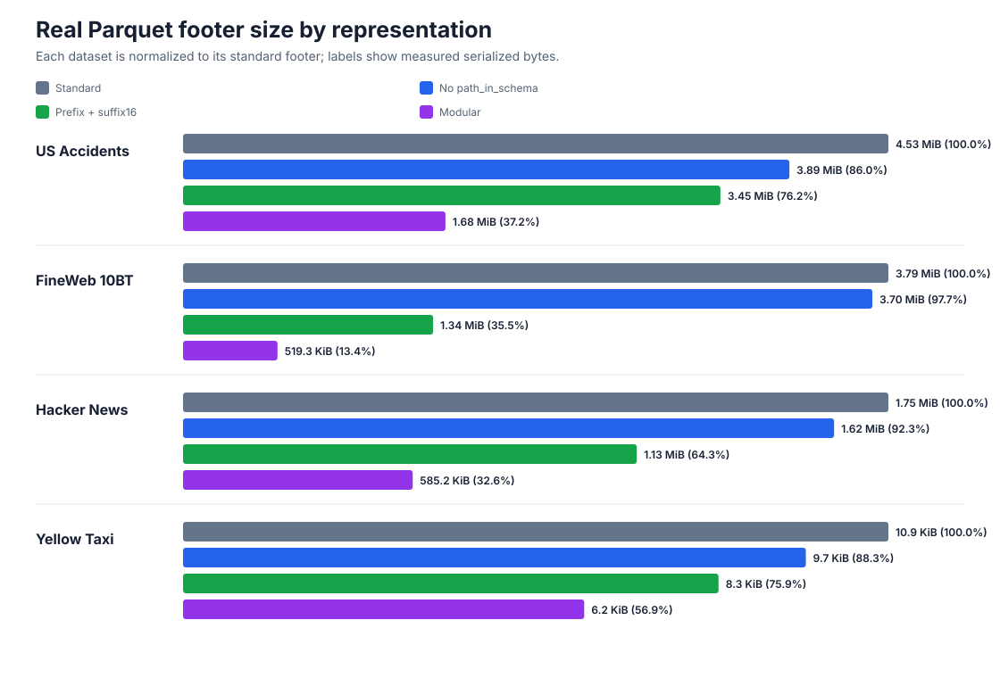
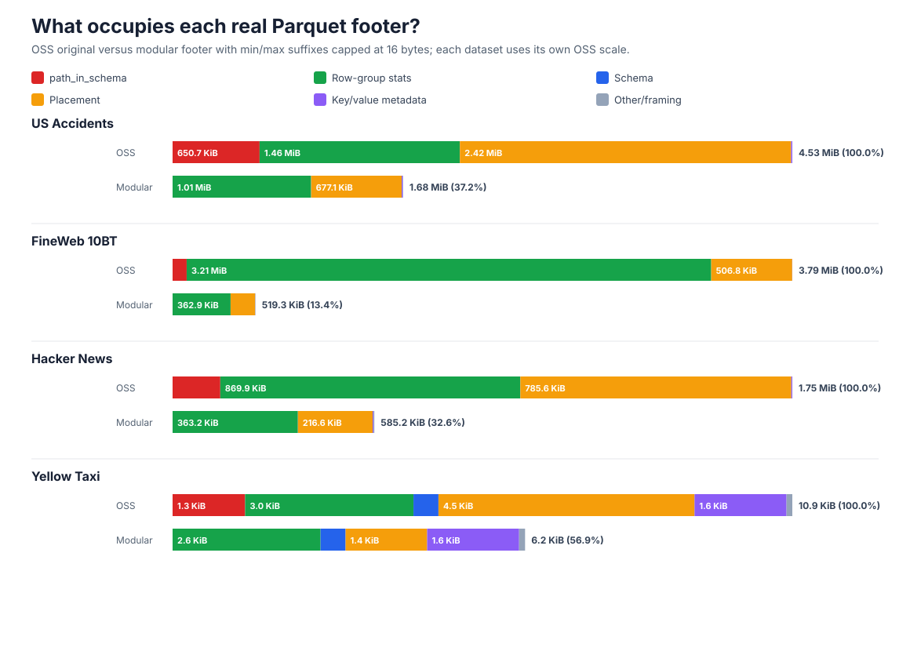

# Real Parquet footer-size benchmark

This benchmark compares footer representations using four unmodified Parquet files curated by
[Raincloud](https://github.com/spiraldb/raincloud). Three naturally have large footers; Yellow
Taxi is the normal-footer control. URLs, object sizes, footer sizes, and SHA-256 hashes are pinned
in `corpus.json`.

The tools are deliberately separate:

```sh
# Fetch only eight bytes per object and verify the pinned remote sizes.
python3 real-footer-size/probe_remote.py

# Download all four files (~2.65 GB) and verify their complete SHA-256 hashes.
python3 real-footer-size/download.py

# Inspect exact standard footer sizes from the downloaded files.
python3 real-footer-size/footer_size.py

# Regenerate the checked-in visualization.
python3 real-footer-size/visualize.py

# Regenerate the separate stacked component visualization.
python3 real-footer-size/footer_breakdown.py
```

Build the dependency-free modular converter before running the footer measurement or either
visualization command:

```sh
cmake -S . -B build -DCMAKE_BUILD_TYPE=Release
cmake --build build -j --target modular_footer_convert
```





Downloads use an atomic `.part` file and land in the gitignored `real-footer-size/data/` directory.
Pass one or more dataset names to either command to operate on a subset.

`footer_size.py` owns footer inspection and comparison; the downloader contains no footer-format
logic. It reports three compact-Thrift representations:

1. The byte-for-byte standard Parquet footer.
2. The standard footer with `ColumnMetaData.path_in_schema` omitted. This is experimental because
   the field is required by the current Parquet Thrift definition.
3. Variant 2 with each column chunk's statistics represented by one common prefix for min and max,
   followed by separate min and max suffixes capped at 16 bytes. Deprecated duplicate min/max
   fields are removed, and existing exactness flags are cleared when either suffix is truncated.

The third representation uses statistics field IDs 1, 2, and 5 for the prefix, min suffix, and max
suffix respectively. It is an explicit experimental wire layout, not standard Parquet. Change the
limit with `--suffix-limit`.

Before transforming a footer, the tool decodes and re-encodes it and requires byte-for-byte
equality. Thus every standard size is fidelity-checked against the actual downloaded footer rather
than estimated.

Current results with a 16-byte suffix limit:

| dataset | standard | no path | prefix + suffix16 | modular |
|---|---:|---:|---:|---:|
| US Accidents | 4,747,144 | 4,080,829 | 3,616,584 | 1,766,176 |
| FineWeb 10BT | 3,971,883 | 3,881,669 | 1,408,067 | 531,813 |
| Hacker News | 1,840,138 | 1,698,502 | 1,183,709 | 599,212 |
| Yellow Taxi | 11,212 | 9,900 | 8,512 | 6,377 |

The comparison excludes page indexes. Standard Parquet stores its page-index blobs outside the
footer, while the modular representation embeds them in modules, so including them on only one
side would not be an apples-to-apples footer-size comparison.

Both prefix-based representations cap each min/max suffix at the configured limit (16 bytes in the
table), so their statistics policies are directly comparable.

## Component breakdown

`footer-components.svg` keeps the total-size graph separate and divides both representations into
`path_in_schema`, row-group statistics, schema, placement, key/value metadata, and residual
framing. Placement covers offsets, sizes, codecs, and physical types. The OSS split uses
progressive clearing: it removes every path, every `ColumnMetaData.statistics`, then
`FileMetaData.row_groups`, `FileMetaData.schema`, and `FileMetaData.key_value_metadata`. The
serialized-size difference at each step is assigned to that component, so the components add up
exactly despite compact-Thrift field-header interactions.

For modular footers, schema and placement are the corresponding modules and `path_in_schema` is
zero because the schema supplies the mapping. Statistics include both the per-column descriptors
and the row-group-statistics directory. Key/value metadata is isolated inside the file-metadata
module; created-by, the modular root directory, and framing remain in other. Page indexes are
excluded from both representations.

## Common-prefix sharing versus truncation

The last column above combines two effects. Running with an effectively unlimited suffix isolates
the common-prefix representation; comparing that result with the 16-byte result isolates the
additional effect of truncation:

| dataset | no path | prefix, untruncated | prefix + suffix16 | prefix saving | truncation saving |
|---|---:|---:|---:|---:|---:|
| US Accidents | 4,080,829 | 3,744,296 | 3,616,584 | 336,533 | 127,712 |
| FineWeb 10BT | 3,881,669 | 3,784,175 | 1,408,067 | 97,494 | 2,376,108 |
| Hacker News | 1,698,502 | 1,563,106 | 1,183,709 | 135,396 | 379,397 |
| Yellow Taxi | 9,900 | 8,512 | 8,512 | 1,388 | 0 |

FineWeb's large reduction is therefore almost entirely truncation (96% of its statistics saving),
while US Accidents benefits mostly from the prefix representation. Hacker News is mixed but leans
toward truncation, and Yellow Taxi has no statistic longer than the 16-byte suffix limit.

There is one important accounting caveat: the standard Arrow-written files contain both legacy
`min`/`max` and modern `min_value`/`max_value` fields. The experimental representation replaces
those four bounds with one prefix and two suffixes. Consequently, "prefix saving" above includes
both common-prefix sharing and removal of the duplicate legacy bounds; it does not measure prefix
sharing in isolation.

Reproduce the two measurements with:

```sh
python3 real-footer-size/footer_size.py --suffix-limit 1000000000 --csv
python3 real-footer-size/footer_size.py --suffix-limit 16 --csv
```
